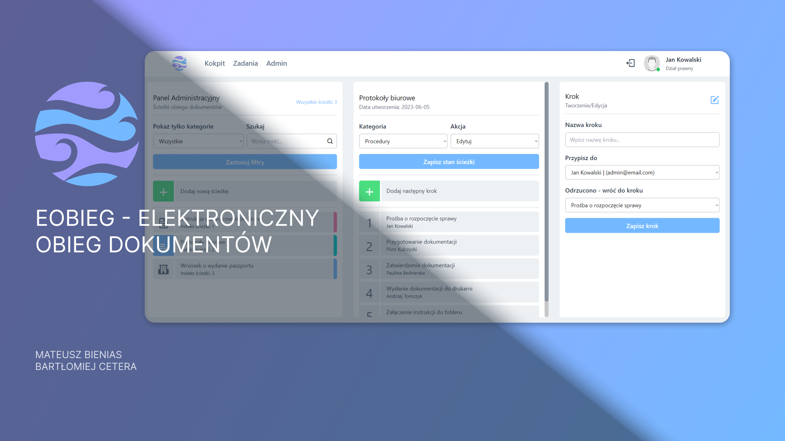

# eOBIEG - Electronic Document Management System 

## main - production branch

### :rocket: Presentation viedo

### :rocket: Installation steps

1. Clone repository
2. Install dependencies for client by running command:
   `npm install`
3. Install dependencies for server by running command:
   `npm install`
4. Run server using command:
   `npm run dev`
5. Run client using command:
   `npm run dev`
   
### :building_construction: Geting started using docker
1. Clone repository
2. Build containers:
   `docker-compose up --build`
3. Run migrations for DB (go to ./server folder):
   `npm run migrations`
4. Run seeders (if needed):
   `npm run seeders`
5. Applications should open on the following ports: 

|Database                |WEB-Client                          |API-Server                         |
|----------------|-------------------------------|-----------------------------|
|    |            |             |
|:`5432`         |:`3000`            |:`5000`            |
